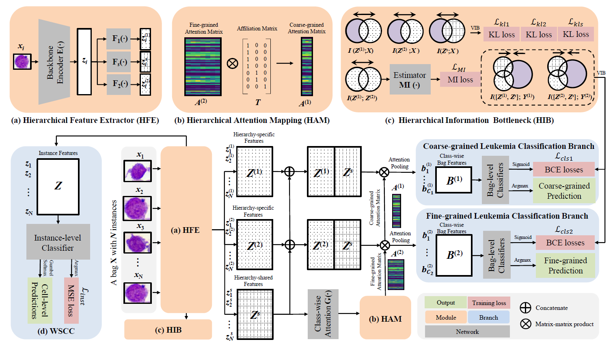

# HMIL_HIB
The source code of paper in xxxx **Childhood Leukemia Classification via Information Bottleneck Enhanced Hierarchical Multi-Instance Learning**

A Hierarchical Multi-Instance Learning (H-MIL) framework equipped with Information Bottleneck (IB) for fully automating the process of Childhood Leukemia subtyping.

We formulate the subtyping task as a multi-instance hierarchical classification problem that uses instances (several BM cells from a patient) to predict their patient-level hierarchical subtypes (i.e., the coarse-grained leukemia types and the fine-grained subtypes).

Following the information bottleneck principle, we propose a hierarchical IB to constrain and refine the representations of different hierarchies for better accuracy and generalization.

## Requirements
- Python 3.6+
- torch 1.7.0
- torchvision 0.8.1
- tensorboardX 2.1
- opencv-python 4.3.0.36
- numpy 1.21.5
- pandas 1.3.5
- histomicstk 1.1.0
- imgaug 0.4.0
- scikit-image 0.18.3

## Dataset
- Downloa

## Usage

### Pre-processing
Generate Datasets for training `./data_preprocess.ipynb`.

### Training
1. Customize the configuration file `./config.py`.
2. Run `python main_hierarchy_CLUB.py --gpus=1 --data=fold1`.

### Test
Evaluate the model by `./Test.ipynb`.

## Citation

If any part of this code is used, please give appropriate citation to our paper.

## Authors
- Zeyu Gao (betpotti@gmail.com)
- Anyu Mao (maoanyu@stu.xjtu.edu.cn)
- Chen Li (cli@xjtu.edu.cn)

## Institute
[BioMedical Semantic Understanding Group](http://www.chenli.group/home), Xi'an Jiaotong University.

## License
This project is licensed under the MIT License - see the [LICENSE](./LICENSE) file for details.

## Acknowledgements
We have great thanks to the implementation of CLUB by [Linear95](https://github.com/Linear95/CLUB) and HoverNet by [vqdang](https://github.com/vqdang/hover_net).
