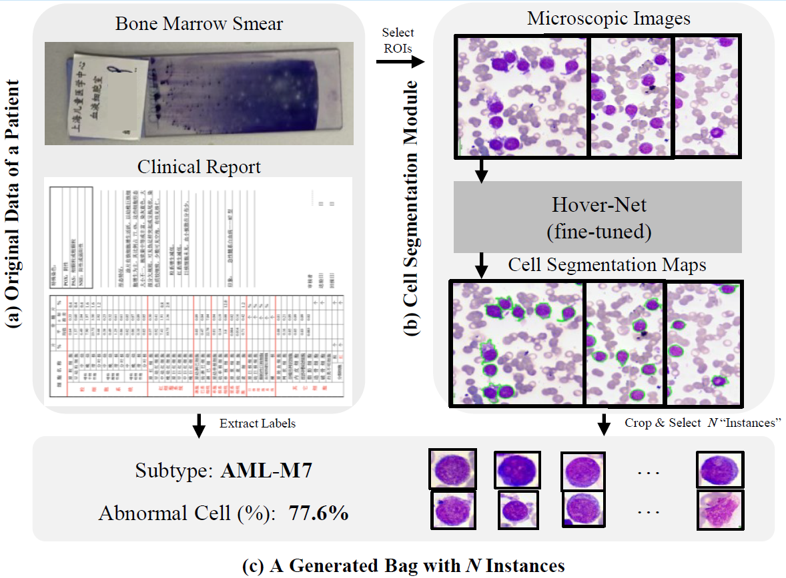

# Bone Marrow Cell segmentation Part

This folder is for the first step of our proposed framework.

This code is revised from the source code of [HoVerNet](https://github.com/vqdang/hover_net).

## Set Up Environment
Please set up your enviroment follow https://github.com/vqdang/hover_net.

## Usage
Set up the `image_dir`, `output_dir`, and `model_path` in `segmentation.ipynb`, and run it.

The predicted mask of each image will be save in ".mat" on the `output_dir`.

## Model File
The trained model need to be download from our nextcloud.

The link is [download_link](https://nextcloud.chenli.group/index.php/s/Lio6zGg3eR8J7Wf)
